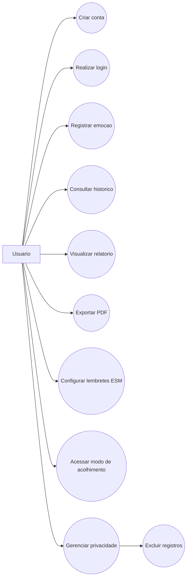
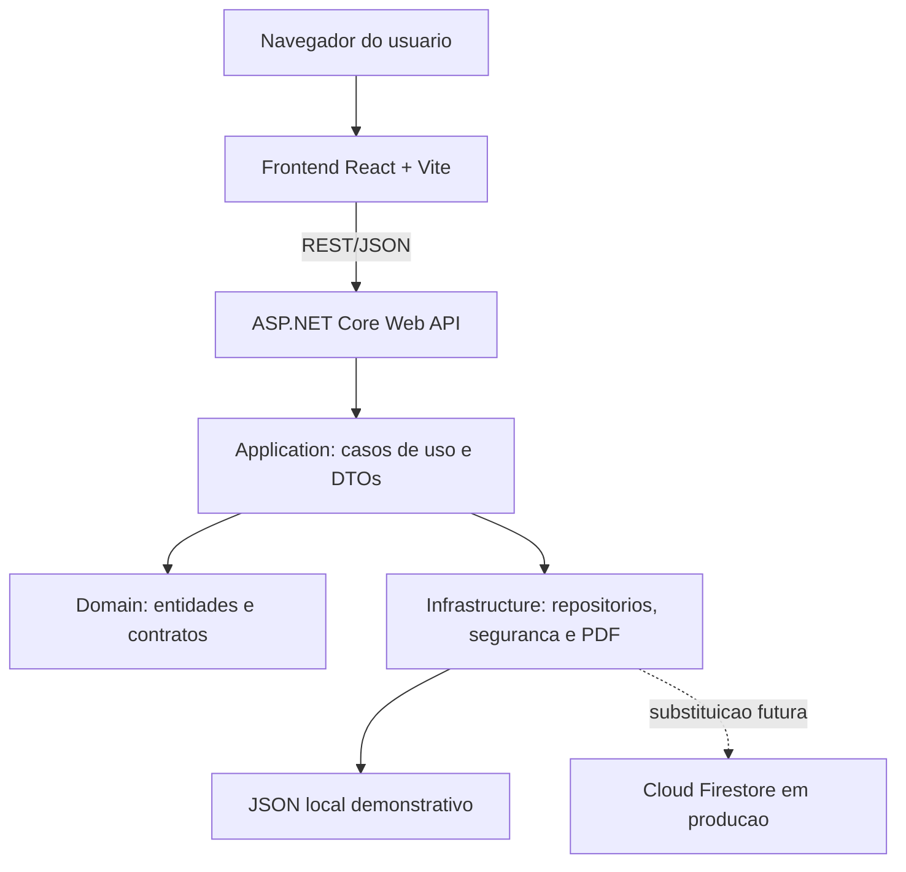
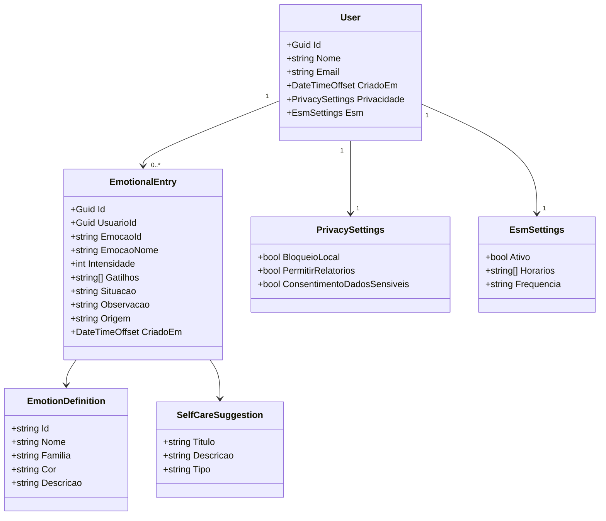

# 4. Desenvolvimento

Este topico apresenta o desenvolvimento da construcao do produto de software Diario Emocional Inteligente. A aplicacao foi desenvolvida como um sistema web responsivo, composto por frontend em React e backend em ASP.NET Core Web API, com foco em registro emocional, acompanhamento historico, relatorios, configuracoes de lembretes inspirados no Experience Sampling Method e recursos de privacidade.

O desenvolvimento foi conduzido de forma incremental, alinhado aos objetivos especificos definidos na introducao: levantamento das funcionalidades essenciais, definicao da arquitetura, implementacao do fluxo principal de uso, organizacao da interface e validacao tecnica inicial.

## 4.1 Modelagem funcional

O ator principal do sistema e o usuario autenticado. Ele pode criar conta, acessar o diario, registrar emocoes, consultar historico, visualizar relatorios, configurar lembretes, acessar o modo de acolhimento e gerenciar seus dados pessoais.

### Diagrama de caso de uso



Figura 1 - Diagrama de caso de uso simplificado do Diario Emocional Inteligente. Fonte: elaborado pelo autor (2026).

## 4.2 Arquitetura do software

A arquitetura foi organizada com separacao de responsabilidades entre frontend, API, regras de negocio, dominio e infraestrutura. Essa organizacao facilita manutencao, evolucao e substituicao de componentes, como a troca da persistencia local por Cloud Firestore em uma versao de producao.

No backend, a estrutura foi dividida em quatro camadas principais:

- `Api`: contem os endpoints REST e adaptadores HTTP.
- `Application`: contem casos de uso, DTOs, servicos de aplicacao e estrategias de autocuidado.
- `Domain`: contem entidades e contratos de repositorio.
- `Infrastructure`: contem implementacoes concretas de persistencia, seguranca e exportacao PDF.

No frontend, a aplicacao React foi organizada em componentes, constantes e servicos de comunicacao com a API.

### Diagrama de arquitetura



Figura 2 - Arquitetura logica do software. Fonte: elaborado pelo autor (2026).

## 4.3 Diagrama de classes simplificado

O modelo de dominio principal contempla usuarios, sessoes, registros emocionais, configuracoes de privacidade, configuracoes ESM e sugestoes de autocuidado.



Figura 3 - Diagrama de classes simplificado. Fonte: elaborado pelo autor (2026).

## 4.4 Tecnologias utilizadas

As tecnologias utilizadas foram escolhidas por compatibilidade com aplicacoes web modernas, facilidade de manutencao e possibilidade de escalabilidade:

- React: construcao da interface por componentes reutilizaveis.
- Vite: ambiente de desenvolvimento rapido para frontend.
- ASP.NET Core Web API: construcao dos endpoints REST e organizacao das regras de negocio.
- JSON local: persistencia demonstrativa para execucao academica sem credenciais externas.
- Cloud Firestore: banco NoSQL previsto para evolucao em producao.
- Firebase Authentication ou OAuth 2.0: autenticacao prevista para ambiente produtivo.
- GitHub: publicacao obrigatoria do codigo-fonte.

## 4.5 Padroes de projeto e principios aplicados

O projeto foi estruturado para seguir boas praticas de Engenharia de Software:

- SOLID: separacao de responsabilidades, dependencia de abstracoes e baixo acoplamento.
- Repository Pattern: isolamento do acesso aos dados por meio de interfaces.
- Strategy Pattern: regras de sugestao de autocuidado variam conforme a emocao.
- Factory Pattern: selecao da estrategia de autocuidado adequada.
- Dependency Injection: configuracao centralizada das dependencias.
- DTO Pattern: separacao entre dados trafegados na API e entidades internas.

Essa organizacao permite que a persistencia demonstrativa em JSON seja substituida por Firestore sem alterar os casos de uso principais.

## 4.6 Principais telas do produto

As telas implementadas no frontend representam o fluxo principal do usuario:

1. Tela de cadastro e login.
2. Tela inicial com resumo diario.
3. Tela de registro emocional.
4. Tela de historico emocional.
5. Tela de relatorio semanal.
6. Tela de configuracoes ESM e privacidade.
7. Modo de acolhimento.

### Prints a inserir no TCC

Substitua os itens abaixo por imagens capturadas da aplicacao em execucao:

- Figura 4 - Tela de login e cadastro.
- Figura 5 - Tela de registro emocional.
- Figura 6 - Historico emocional em linha do tempo.
- Figura 7 - Relatorio visual semanal.
- Figura 8 - Configuracoes de privacidade e lembretes ESM.
- Figura 9 - Modo de acolhimento.

## 4.7 Trechos relevantes de codigo-fonte

### Endpoint REST para registro emocional

Arquivo: `backend/Api/EndpointMapping.cs`

```csharp
app.MapPost("/api/registros", async (HttpContext http, CreateEntryRequest request, IAuthService auth, IEntryService entries) =>
{
    var user = await http.GetAuthenticatedUserAsync(auth);
    if (user is null) return Results.Unauthorized();

    var result = await entries.CreateAsync(user.Id, request);
    return result.Success
        ? Results.Created($"/api/registros/{result.Value!.Id}", result.Value)
        : Results.BadRequest(new { mensagem = result.Error });
});
```

### Servico de aplicacao para criar registro

Arquivo: `backend/Application/Services/EntryService.cs`

```csharp
var suggestedAction = suggestions.Create(emotion.Id, request.Intensidade).First();
var entry = new EmotionalEntry(
    Guid.NewGuid(),
    userId,
    emotion.Id,
    emotion.Nome,
    emotion.Familia,
    request.Intensidade,
    triggers,
    request.Situacao.Trim(),
    request.Observacao.Trim(),
    suggestedAction.Titulo,
    string.IsNullOrWhiteSpace(request.Origem) ? "espontaneo" : request.Origem.Trim(),
    DateTimeOffset.UtcNow);
```

### Strategy Pattern para sugestoes de autocuidado

Arquivo: `backend/Application/Strategies/SelfCareStrategies.cs`

```csharp
public sealed class AnxietyFearStrategy : ISelfCareStrategy
{
    public bool CanHandle(string emotionId) => EmotionIds.Contains(emotionId);

    public IReadOnlyList<SelfCareSuggestion> Build(int intensity) => WithCrisisIfNeeded(intensity, new[]
    {
        new SelfCareSuggestion("Respiracao 4-6", "Inspire por 4 segundos e expire por 6 por tres minutos.", "respiracao"),
        new SelfCareSuggestion("Cheque de realidade", "Anote uma evidencia a favor e uma contra o pensamento ansioso.", "reflexao"),
        new SelfCareSuggestion("Aterramento 5-4-3-2-1", "Use os sentidos para voltar ao presente.", "crise")
    });
}
```

### Cliente HTTP do frontend

Arquivo: `frontend/src/services/apiClient.js`

```javascript
export function createApiClient({ token, onUnauthorized }) {
  async function request(path, options = {}) {
    const response = await fetch(`${API_URL}${path}`, {
      ...options,
      headers: {
        'Content-Type': 'application/json',
        ...(token ? { Authorization: `Bearer ${token}` } : {}),
        ...(options.headers ?? {})
      }
    });
  }
}
```

## 4.8 Requisitos de implantacao

Para executar localmente, sao necessarios:

- .NET SDK 8 ou superior.
- Node.js 20 ou superior.
- NPM.
- Navegador moderno.

Para implantacao em producao, recomenda-se:

- API hospedada em servidor compativel com ASP.NET Core.
- Frontend publicado em hospedagem estatica.
- HTTPS obrigatorio.
- CORS restrito ao dominio do frontend.
- Variaveis de ambiente para chaves e credenciais.
- Firestore com regras de seguranca por usuario.
- Firebase Authentication ou OAuth 2.0.
- Logs sem exposicao de dados sensiveis.
- Rotina de backup e exclusao de dados conforme LGPD.

## 4.9 Repositorio publico

Requisito obrigatorio do TCC:

```text
Repositorio publico do codigo-fonte: <inserir link do repositorio publico no GitHub>
```

Antes da entrega final, publique o projeto no GitHub e substitua o campo acima pelo link real do repositorio.

